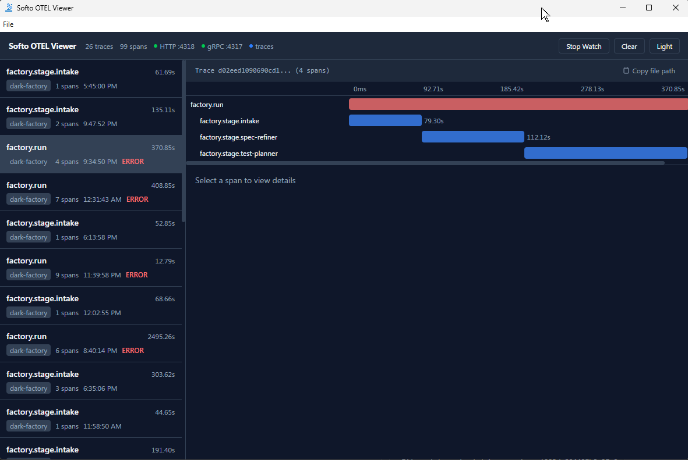

# Softo OTEL Viewer

A local desktop application for viewing OpenTelemetry traces and spans during development. Built with Electron, React, and TypeScript.

> **Note:** This tool is designed for local debugging and development only. It is not intended for production use.



## Features

- **HTTP OTLP receiver** on port `4318` (`/v1/traces`)
- **gRPC OTLP receiver** on port `4317`
- **Watch folder** mode — monitors a directory for `.json` trace files
- Trace list with service name, span count, duration, and error indicators
- Gantt-style span timeline visualization
- Span detail view with attributes, resource attributes, events, and links
- Dark/light mode toggle (`Ctrl+D`)
- Clear all traces (`Ctrl+L`)
- Automatic eviction (keeps the latest 1000 traces)

## Prerequisites

- [Node.js](https://nodejs.org/) >= 18
- npm

## Install dependencies

```bash
npm install
```

## Development

Start the app in dev mode with hot reload:

```bash
npm run dev
```

## Build

Build the app for production:

```bash
npm run build
```

Run the built app:

```bash
npx electron .
```

## Package

Create a portable Windows executable:

```bash
npm run package
```

The output will be in the `dist/` directory.

## Usage

1. Start the app (`npm run dev` or the packaged executable).
2. Point your OpenTelemetry SDK exporter to `http://localhost:4318` (HTTP) or `localhost:4317` (gRPC).
3. Traces appear in the left panel as they arrive.
4. Alternatively, click **Watch Folder** to monitor a directory for `.json` files containing OTLP trace data.

## Project structure

```
src/
  main/          Electron main process
    otlp/          HTTP receiver, gRPC receiver, file watcher
    store/         In-memory trace/span store
    ipc/           IPC channel definitions and handlers
  preload/       contextBridge API
  renderer/      React UI
    components/    Header, TraceList, TraceDetail, SpanTimeline, SpanDetail
    stores/        Zustand app store
proto/           Vendored OpenTelemetry protobuf definitions
```

## Tech stack

- [electron-vite](https://electron-vite.org/) — build tooling
- [React](https://react.dev/) — UI
- [Tailwind CSS](https://tailwindcss.com/) v4 — styling
- [Zustand](https://zustand.docs.pmnd.rs/) — state management
- [@grpc/grpc-js](https://www.npmjs.com/package/@grpc/grpc-js) — gRPC OTLP receiver
- [protobufjs](https://www.npmjs.com/package/protobufjs) — HTTP OTLP protobuf decoding

## Inspiration

This software was inspired by [otel-desktop-viewer](https://github.com/CtrlSpice/otel-desktop-viewer) by CtrlSpice